超级电容控制板

双向同步整流BUCK-BOOST数字电源板

V0.1 2025/2/5 创建文档，初步编辑

★★★由于使用了一些没有对外公开的资料 注意保密★★★

# 1 绪论

## 1.1双向DC-DC概述

## 1.2系统方案结构

## 1.3设计指标及功能

- [ ] 输入电压：24V
- [ ] 输出电流：额定电流5A 
- [ ] 额定功率：150W 
- [ ] 最大效率：高达95% 
- [ ] 稳压精度：5% 
- [ ] 输出电压：0-24V 
- [ ] 最大电流：6.5A 
- [ ] 最大功率：240W（加强冷风扇条件下） 
- [ ] 开关频率200KHz，高频率驱动设计，支持更小的电感电容、减小板子尺寸提高功率密度比 
- [ ] 保护功能：输入欠压、过压保护；输出过压、过流保护 
- [ ] 运行、故障等状态指示

## 1.4

## 1.4

# 2 双向BUCK-BOOST实现原理

## 2.1经典BUCK电路

工作原理：当Up为高时，Q1到导通，D1反向截止；直流电Ui通过Q1为电感L1储能并为负载 提供能量，这一过程中由于Ui＞Uo,Ui-Uo的电压加在电感上，在电感没有饱和前，电感电流线性增加，电感储能；当Up为低时，Q1截止，电感电流线性减少，由楞次定律可以电感L1上会产生一个 “右正左负”的感应电动势，此时**电感L1电容CE2释放能量**通过整流二极管为负载供电，整流二 极管正向导通。

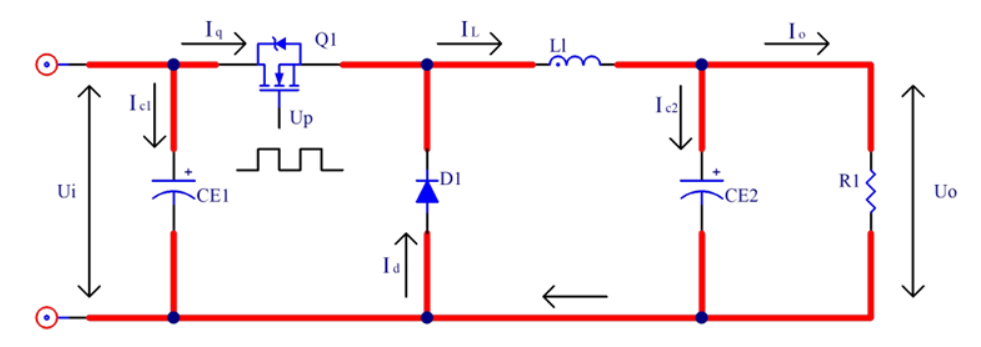

波形分析：由上述分析画出如下图所示的先关波形，Q1导通期间电感L1储存能量，Q1截止期 间电感L1释放能量，**根据整个开关周期内电感电流是否存在零点**，即上一周期储存的能量在下一周 期到了之前，电感L1储存的能量是否完成释放，电感电流减小为零，可将BUCK电路的工作模式 分为**连续工作模式**和**不连续工作模式**，要使BUCK电路工作稳定需要工作在连续工作模式下，以下 将着重分析连续工作模式下的波形

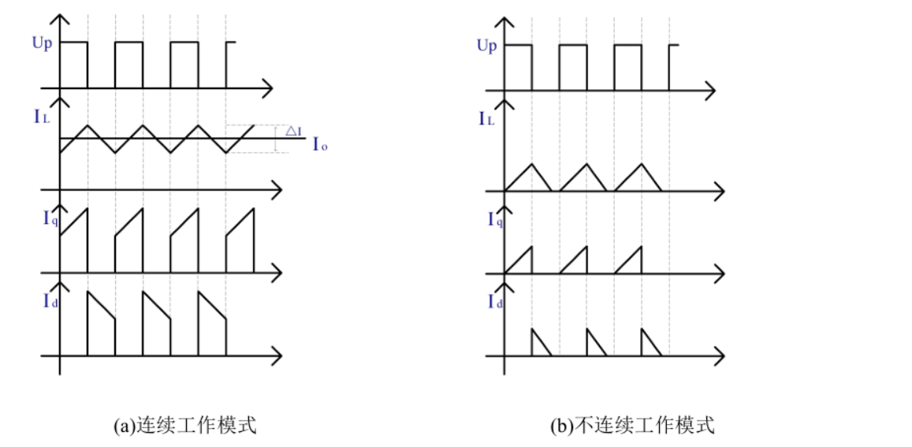

上图（a）为BUCK电源连续稳定工作时的波形，可以看出在Q1在导通期间储存的能量足够在 Q1关断期间释放，在Q1下一次导通之前电感电流没有下降为零，**且在整个开关周期里电感电流的 变化量△I的平均值就是BUCK电路输出的电流**；这可以由能量守恒计算出来。

以下将计算BUCK电路在连续工作模式下的电压增益和电感、电容的大小，如何选型。

## 2.2经典BOOST电路

工作原理：当Q1导通时，**整流二极管D1反向截止**；输入电压Ui加在电感L1两端，电感电流线性增加，电感储能；此时由输出电容CE2想负载R1供电；**当Q1截止整流二极管D1正向导通时， 电感两端的电压减小，电感电流有减小的趋势，由楞次定律可知在电感L1上产生一个“右正左负”电动势，该电动势叠加在输入电压上使电压升高**，经过二极管D1为电容CE2充电和为负载R1供电。 该过程中电感L1释放能量，电容CE2充电，电感电流线性减小。

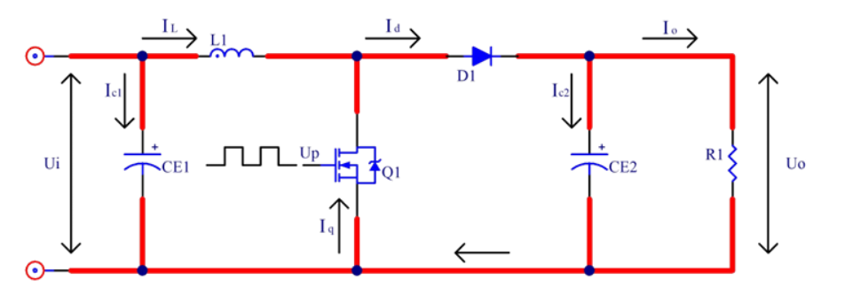

波形分析：和经典BUCK电路相同，根据电感电流在一个开关周期内是否为零，可将BOOST 电路的工作模式分为连续工作模式和不工作连续模式，如图6所示为BOOST电路在连续工作模式 和不工作连续模式下的波形。在连续工作模式下，电感电流纹波为△I;在电感足够大的情况下，电流增加量等于电流减少量。

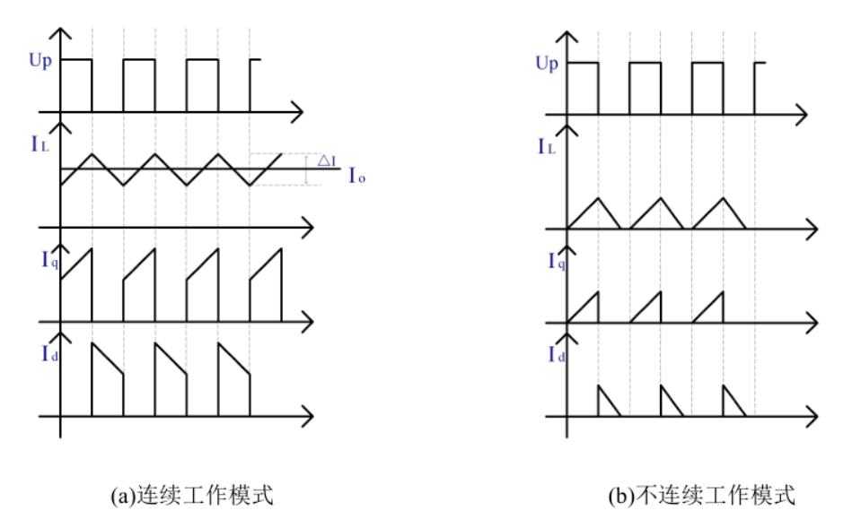

## 2.3双向同步整流BUCK-BOOST电路

双向同步整流BUCK-BOOST电路由同步BUCK电路和同步BOOST电路级联而成，根据BUCK电路电 压增益公式：BU D U U i o ，和BOOST电路电压增益公式： BO 1 1 D U U i o  推出BUCK-BOOST电路电压增益 公式： BO BU i o D D U U  1 ，其中BU D定义为BUCK电路的占空比，对应本设计中MOS管Q1的占空比，BO D定 义为BOOST电路的占空比，对应本设计中MOS管Q4的占空比。本设计中Q1和Q2是一对互补导通 MOS管，Q3和Q4是一对互导通MOS管。

双向同步整流BUCK-BOOST电路根据输入输出的电压关系将 电路工作状态分为降压区、升压区和降压-升压区；

当输出电压显著小于输入电压时，电路工作在降压区，此时Q1和Q2互补导通，Q4常关Q3常通，电路等效于同步BUCK电路；

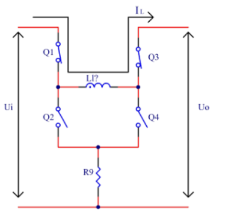

实际应用中由于MOS 管驱动采用自举升压的方式，Q4不能始终截止，否则当Q3的自举电容能量损耗完时，Q3将截止； 为驱动Q3，Q4必须导通一小段时间为Q3的自举电容充电以驱动Q3。因此在实际控制中可将Q4的占空比固定设为0.5（即BO D可根据实际情况调整），而Q1的占空比BU D可在0-0.95之间变化，如 此电路将一直工作在降压区。

当输出电压显著大于输入电压时，电路工作在升压区，此时Q3和Q4互补导通，Q1常关Q2常通，等效于同步BOOST 电路

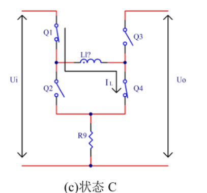

和电路工作在降压区的情况类似，Q2不能始终截止，需要导通一小段时间为Q1的自举电容 充电，因此在实际控制中可将Q1的占空比BU D固定设置为0.95（可根据实际情况调整），而Q4的 占空比可在0-0.95之间变化，如此电路将一直工作在升压区。

当输出电压和输入电压接近时，电路 工作在降压-升压区，即在一个周期内一段时间按降压方式工作，一段时间按升压方式工作。

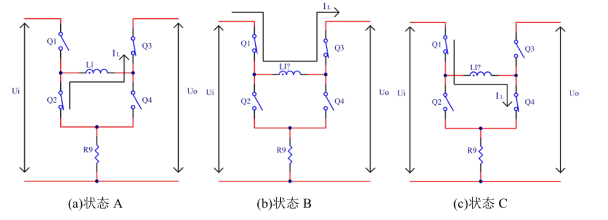

当MOS管在A、B状态之间切换时，电路工作在降压模式；当MOS管在B、C状态之间切换 时，电路工作在升压模式；当MOS管按照状态A-B-C-B-A的顺序却换时，电路工作在降压-升压模 式。如下图所示为电路工作在降压-升压模式时的驱动波形和电感电流波形。

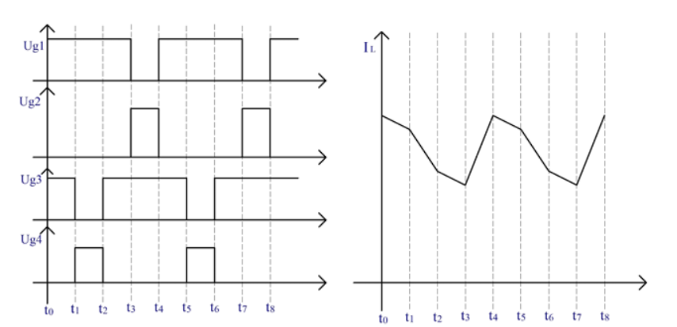

在0 t-1 t阶段电路处于状态B，此时Q1、Q3导通，Q2、Q4截止；当i U> o U时，电感电流增大； 当i U< o U时，电感电流减小。在1 t-2 t阶段电路处于状态C，此时Q1、Q4导通，Q2、Q3截止，电 感电流增大。在2 t-3 t阶段电路处于状态B，在3 t-4 t阶段电路处于状态A，此时Q2、Q3导通，Q1、 Q4截止，电感电流减小。

由BUCK-BOOST电压增益公式可知，不论电路是工作在降压模式、升压 模式还是降压-升压模式，本质上是控制降压占空比BU D和升压占空比BO D。

即Q1、Q2理论上永远互补导通，Q3、Q4永远互补导通

降压占空比Dbu控制Q1 Q2通断，Q3通、Q4断，即Dbo为100%，实现降压

升压占空比Dbo控制Q3 Q4通断，Q1通、Q2断，即Dbu为100%，实现升压

> Tips:
>
> 而对于本设计中的应用，从VIN到VOUT是给超级电容组充电，反向从VOUT到VIN是超级电容组放电，即
>
> 1.在充电情况下，电路只工作在Buck&Buck-Boost模式；
>
> 2.在放电状态下，电路只工作在Buck-Boost&Boost模式。
>

# 3 系统硬件设计

## 3.1BUCK-BOOST主拓扑电路设计

电容计算：
计算得总电容需要
由于两端采用的电容值一致，故选用两颗35V 470uF 35mΩ固态电容➕1颗1uF 100V X7R ➕2颗22uF 50V X7R ➕1颗100uF 50V X7R 最终每侧电容值均为1063uF

由于成本及体积考虑所用的固态电容内阻有些大并且使用的陶瓷电容性能堪忧，所标参数有所怀疑.

电感计算：
计算得总电感需要
一般向上取得电感值为22UH较为保守合适
最大允许通过电流值一般取最大峰值电流15A
在综合考虑体积 内阻 允许通过电流后 选用与上交同款线艺电感XAL1510-223ME 但是其单价高达6.5美元（47.34人民币）通过国内代理也需30元左右价格较高。
如果选用常规1770电感 只需6.5人民币左右 差价7倍 但是其体积占用较大面积 无法再放置固态电容

## 3.2驱动电路设计

MOS管栅极驱动器采用TI具有独立的高侧和低侧驱动的半桥驱动芯片UCC27211，该芯片内部集成自举二极管，外部需要连接自举电容，采用自举升压的方式驱动高侧MOS管；自举电容 选取0.47uF,芯片驱动电流峰值高达4A，最大引导电压直流120V；在PWM信号输入引脚加10K的下 拉电阻，防止PWM信号输入开路或高阻时MOS误动作；MOS管驱动电阻采用4.7Ω。芯片内部不带有 死区功能，为防止上下桥臂通时导通，需要在软件上实现死区功能。

> 确实由于芯片渠道及价格差异。UCC27211强烈建议正规渠道购买正品芯片，淘宝上的芯片参差不齐，良品率达不到保障，或者可以尝试替换为UCC27201

## 3.3辅助电源设计

功率板子上仅有12V栅极驱动电路，其他电源来着控制板上的3.3V

这颗AP63301表现并不好，后期将其替换为RY411

控制板上使用AP63205降压至5V，省去了配置电阻，然后一路LDO降压至3.3V供给数字电路供电，一路生成参考电压3.3V，用作ADC采样。

## 3.4信号调理电路设计

### 3.4.1电流采样电路

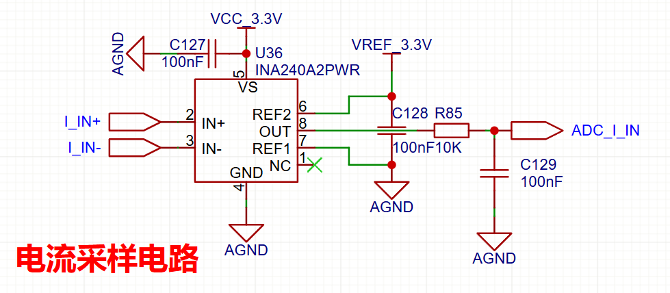

​		电流检测芯片使用INA240，这是一款使用较为广泛具有PWM 抑制的双向电流检测芯片。

  根据INA240芯片手册应用双向电流测量8.4.3.3将输出设置为1/2的参考电压

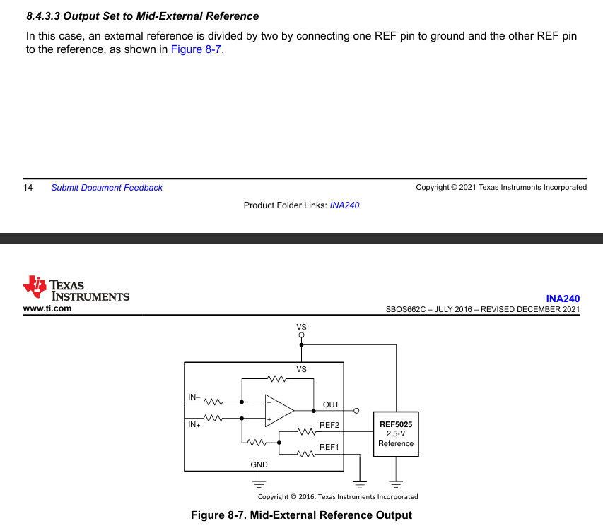

考虑到电源管理模块底盘端口额定电流为10A，最大电流30A持续500ms。一般情况下，电源管理模块输出的电流不超过5A，可以使用较大的采样电阻也不会有太大的功率损失。使用1mR，搭配50倍增益，当经流过电流为30A时，采样电阻两端压差为1mR * 30A=0.03V，100倍增益到MCU的ADC处为1/2VREF±0.03V * 50=3.15Vor0.15V，满足采样要求，但是由于采样范围广，导致采样精度较低。

故采样电阻使用1mR搭配50倍的增益的INA240A2进行采样，所以最大采样电流设置为±30A。

### 3.4.2电压采样电路

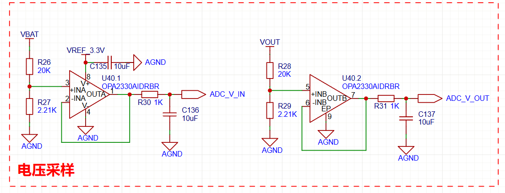

电压主要采集为电池端输入电压及经过FSBB变换后的输出电压即超级电容端的电压，一方面为了功率闭环，另一方面为了估计电容剩余电压。

### 3.4.3系统内各个参数

 ADC_V_IN	 ADC_V_CAP	分别为FSBB输入电压及输出到超级电容端的电压

 

在不考虑无线供电部分，系统各个功率如下：

输入功率为裁判系统(电源) 输入功率P_IN=V_IN* I_IN

底盘输出功率P_CHASSIS=V_IN* I_CHASSIS

FSBB输入功率为P_DCDC=V_IN* I_CAP

超级电容充放电功率为P_CAP=V_CAP* I_CAP

补充：

> 超级电容功率路径图
>
> 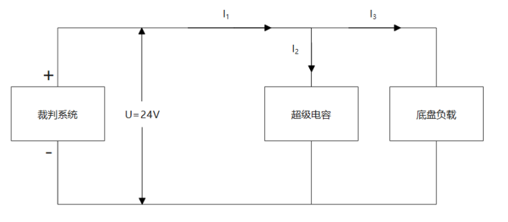
>
> 根据功率守恒有：裁判系统输出功率 = 底盘功率 + 超级电容输出功率。裁判系统的输出功率是由底盘和超级电容决定的。
> 最理想的工作状态是裁判系统恒定以刚好不掉血的限制功率输出，**当底盘功率小于限制功率时超级电容充电来吸收多余的功率，当底盘功率大于限制功率时超级电容放电来提供多余的功率。这样可以使一场比赛中机器人使用的总能量达到最大**。
> 超级电容会检测裁判系统当前输出功率和能量缓冲，自动调节电容的充电或放电功率，使裁判系统输出功率维持在限制功率。
> 但是，超级电容吸收和放出功率的能力是有极限的。当电容充满电时，就不能吸收裁判系统富余的功率；当电容放完电时，就不能提供额外的功率给底盘。另外，电容的最大充放电功率与电容当前电压有关。
> 当电容的最大放电功率不够时，会以能达到的最大功率放电，此时裁判系统输出功率会升高并超过限制功率，消耗能量缓冲，这时需要功率算法限制底盘功率防止超功率扣血。
> 目前，超级电容会使裁判系统的能量缓冲稳定在50J，所以需要将**功率算法**调节到当能量缓冲低于40J时开始限制底盘输出。
> 如果想要超级电容快速充电，可以限制底盘功率或限制超级电容输出功率，注意**要加速的时候不要忘记解除输出功率限制**。
> 电容当前存储的能量，能量E与电压u的平方成正比。
> 另外，电容的最大输出功率与电容当前电压正相关，也就是说，电容电压不同时底盘能达到的最大功率也不同。之前我驱动底盘时基本没有关注过它各个速度下的功率，只是简单的设一个能超过功率限制的速度让它跑，然后再通过能量缓冲限制速度环输出的电流大小。这样在加了超级电容之后是不太好的，由于超级电容最大输出功率会变化，它不同时刻跑的功率和速度不一样。
> 所以加了超级电容之后测试机器人需要考虑它的功率曲线。比如说某个动作的某个时刻的功率超过裁判系统限制功率，需要电容提供额外输出功率时，电容当前的最大输出功率就决定了当前动作能否按照预期实现。

### 3.4.4ADC输入的RC滤波器

RC低通滤波根据手册数据，取采样周期24.5MHz,电阻R取1K，根据一阶 RC 低通滤波器公式
$$
f_c=\frac{1}{2\pi RC}
$$
R取1K，截止频率为10K，计算得C为15uF,实际采用10uF电容与1K电阻构成RC滤波器。

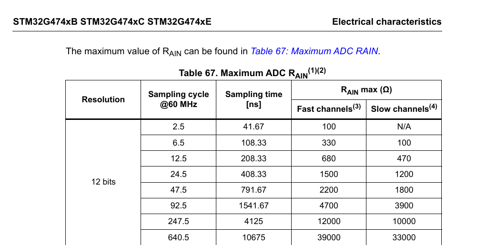

## 3.5数字电路设计
主控芯片选择
F334系列芯片是第一代数字电源开发板的主流芯片 包括港科的超级电容控制器用的也是该芯片 但是其是14年发布的芯片，主频只有72MHz,性能较低。
G474系列芯片包有了高分辨率定时器HRTIM，最高倍频32倍，可以达到5.44GHz，具有丰富的模拟外设如片内运放、片内基准电压源等，可极大的简化外围电路（暂时没有用到，后续迭代）

STM32G474CBT6（48PIN 128KB LQFP）
STM32G474RCT6（64PIN 256KB LQFP）
STM32G474RET6（64PIN 512KB LQFP）

STM32G474CBU6（64PIN 128KB VFQFPN）
STM32G474CCU6（64PIN 256KB VFQFPN）
STM32G474CEU6（64PIN 512KB VFQFPN）

一般情况下选择CBU6其实基本够用了，最小的封装CBT6如果紧缩一下也是足够用的。但是G474芯片价格受市场影响较大，合理选择芯片即可，CCU6价格较低，当下可以使用

H7系列芯片则具有高超的性价比，其高达480MHz的主频频率碾压其他芯片，该系列芯片也逐渐作为机器人的底层主控芯片了。但是该系列芯片没有较小的封装，最小的也是100引脚起步的BGA芯片，空间体积占用较大、引脚浪费、焊接困难😓，同时该芯片没有独立的倍频器，仅支持主频频率480MHz左右的HRTIM。

结论：其实一个数字开关电源，哪怕用最低端的F103可能也够用，满足赛场工况的话，用F334，实现100KHz,200KHz的开关频率去，也足够用了。再者要考虑的也就是主频、外设、封装、价格等因素了。

## 4 系统软件设计

# 5 参考资料
